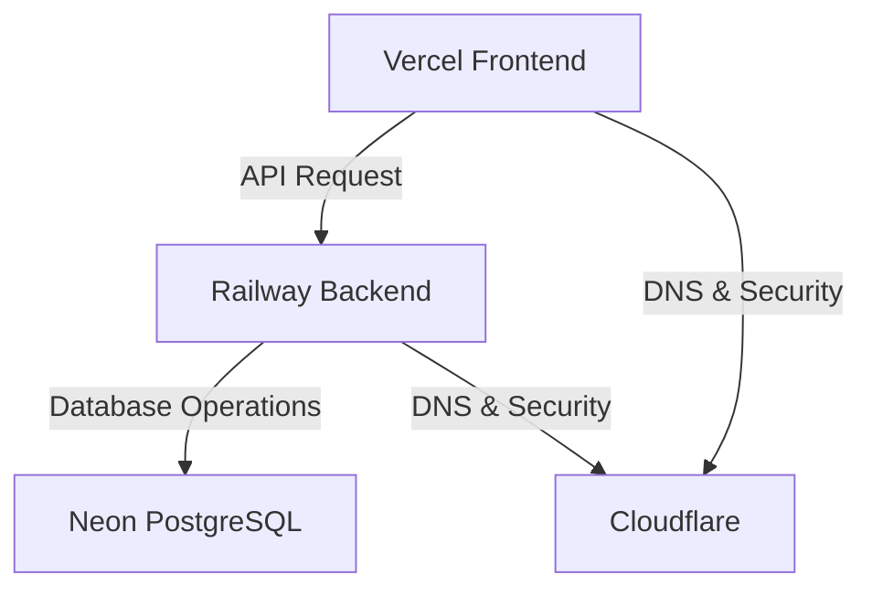

# Denumrutham — Temple Management System (TMS)

A clean, modern, multi-tenant SaaS application for managing temples, poojas, bookings, store inventory, accounting, and staff operations.

## Architecture Overview



This project has been structured as a modern, decoupled monorepo containing two distinct development and deployment boundaries:

1. **`frontend/`**: React 19 + TypeScript + Vite + Tailwind CSS SPA, deployed to Vercel.
2. **`backend/`**: FastAPI + SQLAlchemy 2.0 (asyncpg) + PostgreSQL, deployed to Railway.

---

## Folder Structure

```text
Denumrutham/
├── frontend/             # React Vite SPA (Vercel)
├── backend/              # FastAPI Application (Railway)
│   ├── app/              # Application core code
│   ├── alembic/          # Database migrations
│   └── scripts/          # Organized operations scripts
├── docs/                 # System architecture & manuals
├── archive/              # Data backups & legacy frontend
├── .github/              # CI/CD GitHub Actions workflows
└── docker-compose.yml    # Local development composer
```

---

## Local Development Setup

### 1. Prerequisites
- Docker & Docker Compose
- Node.js (v20+)
- Python 3.12+

### 2. Backend Setup
1. Navigate to the backend directory:
   ```bash
   cd backend
   ```
2. Create and fill out your `.env` file:
   ```bash
   cp .env.example .env
   ```
3. Create a Python virtual environment and install dependencies:
   ```bash
   python -m venv .venv
   source .venv/bin/activate  # On Windows: .venv\Scripts\activate
   pip install -r requirements.txt
   ```
4. Start the local database (if not using docker-compose at root):
   ```bash
   docker compose up db -d
   ```
5. Run the FastAPI development server:
   ```bash
   uvicorn app.main:app --reload --port 8000
   ```

### 3. Frontend Setup
1. Navigate to the frontend directory:
   ```bash
   cd frontend
   ```
2. Install npm dependencies:
   ```bash
   npm install
   ```
3. Run the development server (proxies API requests to backend by default):
   ```bash
   npm run dev
   ```
4. Open [http://localhost:5173](http://localhost:5173) in your browser.

---

## Deployment Guide

### Database (Neon PostgreSQL)
1. Create a serverless PostgreSQL instance on [Neon](https://neon.tech/).
2. Obtain the database connection URI (make sure to select the `asyncpg` variant if configuring backend libraries directly, or use the standard URI which our config wrapper automatically normalizes).
3. Ensure the connection string includes `sslmode=require`.

### Backend (Railway)
1. Connect your GitHub repository to [Railway](https://railway.app/).
2. Create a new service from the `backend/` directory.
3. Configure the following environment variables in Railway:
   - `DATABASE_URL`: Your Neon Postgres connection string.
   - `SECRET_KEY`: A long, secure random string.
   - `JWT_SECRET`: A long, secure random string.
   - `ENVIRONMENT`: `production`
   - `CORS_ALLOWED_ORIGINS`: Comma-separated list of allowed origins (e.g. `https://your-app.vercel.app`).
4. Railway will automatically detect the `Dockerfile` in the directory and build the service.

### Frontend (Vercel)
1. Import your project in [Vercel](https://vercel.com/).
2. Set the **Root Directory** to `frontend`.
3. Select **Vite** as the framework preset.
4. Configure the following Environment Variable:
   - `VITE_API_URL`: The URL of your Railway backend service (without trailing slash, e.g. `https://api.denumrutham.up.railway.app`).
5. Vercel will automatically build and deploy the React SPA.

---

## License

This project is proprietary and confidential. All rights reserved.
