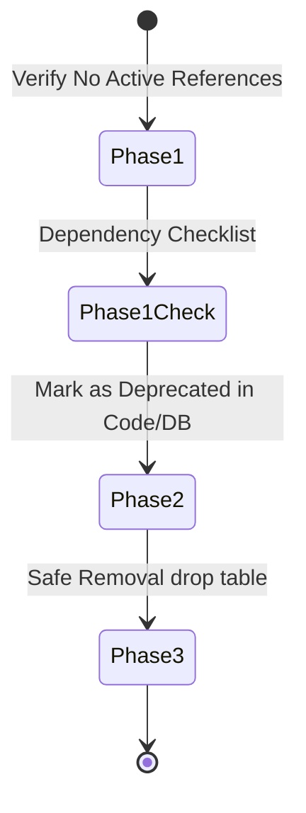

# Denumrutham Enterprise API Governance & Swagger Alignment Audit
## Final Version — Approved for Implementation

This document contains the completed Enterprise API Governance and Swagger Alignment Audit, incorporating the directives from the Final Engineering Review. It defines the definitive developer contract, mapping FastAPI endpoints, database models, Pydantic schemas, and RBAC permissions, and provides a 6-phase remediation roadmap.

---

## 1. Ledger Concept Clarifications & Single Source of Truth

The platform distinguishes between two separate financial ledger structures, each serving a distinct, non-overlapping operational responsibility. To prevent future architectural ambiguity, these ledgers must **never** be merged:

### 1.1 Enterprise Master Ledger (`transactions` table)
* **Purpose**: Operational Accounting.
* **Model Class**: `Transaction` in [billing_models.py](file:///c:/Denumrutham/backend/app/modules/billing/models/billing_models.py)
* **Scope**: Acts as the single source of truth for all general temple cash inflows and outflows, including:
  * Counter income & POS transactions
  * Archana counter/offline bookings (to be migrated from `financial_ledger`)
  * Hall booking operational income
  * Store and canteen commerce sales
  * Departmental inventory purchases & operational expenses
  * Employee salary payouts
  * Devotee donations & hundi offerings

### 1.2 Online Settlement Ledger (`online_settlement_ledger` table)
* **Purpose**: Settlement Accounting.
* **Model Class**: `OnlineSettlementLedger` in [finance_models.py](file:///c:/Denumrutham/backend/app/modules/finance/models/finance_models.py)
* **Scope**: Serves as the immutable registry for online gateway transactions and their associated platform fee structures. It manages:
  * Online payments and transaction splits
  * Gross convenience fees charged to devotees
  * GST/CGST/SGST fee taxation components
  * Gateway fees and absorbed payment gateway taxes
  * Net platform revenue collections
  * Net temple payout balances
  * Settlement batch reconciliation and bank payout tracking

---

## 2. FastAPI API Router & Path Inventory

The backend routing architecture registered in [api.py](file:///c:/Denumrutham/backend/app/api/api_v1/api.py) relies on proxy files in `app/api/api_v1/endpoints/` and `app/api/routes/` which forward calls to domain sub-modules under `app/modules/`.

Below is the complete inventory of registered routers, prefixes, physical routes, tags, and role classifications:

| Router Prefix | Registered Route | Swagger Tag | Physical File Path | Role Classification |
| :--- | :--- | :--- | :--- | :--- |
| `/public/temples` | `public_portal.router` | `Public Temple Portal` | [public_portal.py](file:///c:/Denumrutham/backend/app/modules/temple_management/routes/public_portal.py) | Devotee / Public |
| `/public/directory` | `public_portal.directory_router` | `Public Directory` | [public_portal.py](file:///c:/Denumrutham/backend/app/modules/temple_management/routes/public_portal.py) | Devotee / Public |
| `/public` | `public_portal.public_router` | `Public Platform Directory` | [public_portal.py](file:///c:/Denumrutham/backend/app/modules/temple_management/routes/public_portal.py) | Devotee / Public |
| `/public` | `telemetry_public_router` | `Public Telemetry` | [telemetry.py](file:///c:/Denumrutham/backend/app/modules/analytics/routes/telemetry.py) | Devotee / Public |
| `/sync` | `sync.router` | `System Sync` | [sync.py](file:///c:/Denumrutham/backend/app/api/api_v1/endpoints/sync.py) | System Agent / POS |
| `/health` | `health.router` | `Health Check` | [health.py](file:///c:/Denumrutham/backend/app/api/api_v1/endpoints/health.py) | Public |
| `/auth` | `auth.router` | `Authentication` | [auth.py](file:///c:/Denumrutham/backend/app/api/api_v1/endpoints/auth.py) | Public / All Roles |
| `/system` | `system.router` | `System Integrity` | [system.py](file:///c:/Denumrutham/backend/app/api/api_v1/endpoints/system.py) | Super Admin / System |
| `/devotees` | `devotees.router` | `Devotees` | [devotees.py](file:///c:/Denumrutham/backend/app/modules/bookings/routes/devotees.py) | Manager / Staff |
| `/poojas` | `poojas.router` | `Poojas & Offerings` | [poojas.py](file:///c:/Denumrutham/backend/app/modules/bookings/routes/poojas.py) | Manager / Staff |
| `/bookings` | `bookings.router` | `Bookings` | [bookings.py](file:///c:/Denumrutham/backend/app/modules/bookings/routes/bookings.py) | Manager / Staff |
| `/donations` | `donations.router` | `Donations` | [donations.py](file:///c:/Denumrutham/backend/app/modules/billing/routes/donations.py) | Manager / Staff |
| `/notifications`| `notifications.router` | `Notifications` | [notifications.py](file:///c:/Denumrutham/backend/app/modules/bookings/routes/notifications.py) | Devotee / Manager |
| `/temples` | `temples.router` | `Temples` | [temples.py](file:///c:/Denumrutham/backend/app/modules/temple_management/routes/temples.py) | Super Admin |
| `/upload` | `upload.router` | `Media Uploads` | [upload.py](file:///c:/Denumrutham/backend/app/api/routes/upload.py) | Manager / Staff |
| `/payments` | `payments.router` | `Payment Processing` | [payments.py](file:///c:/Denumrutham/backend/app/modules/billing/routes/payments.py) | Devotee |
| `/subscriptions`| `subscriptions_router` | `Subscriptions` | [subscriptions.py](file:///c:/Denumrutham/backend/app/modules/billing/routes/subscriptions.py) | Super Admin |
| `/rbac` | `rbac.router` | `Access Control (RBAC)` | [rbac.py](file:///c:/Denumrutham/backend/app/modules/auth/routes/rbac.py) | Super Admin / Manager |
| `/claims` | `claims_router` | `Temple Claims` | [claims.py](file:///c:/Denumrutham/backend/app/modules/governance/routes/claims.py) | Super Admin / Public |
| `/temple-suggestions`| `suggestions_router` | `Temple Suggestions` | [suggestions.py](file:///c:/Denumrutham/backend/app/modules/governance/routes/suggestions.py) | Super Admin / Public |
| `/audit-logs` | `audit.router` | `Audit Trails` | [audit.py](file:///c:/Denumrutham/backend/app/api/api_v1/routes/audit.py) | Super Admin / Auditor |
| `/manager/activity-logs`| `activity_logs.router` | `Activity Logs` | [activity_logs.py](file:///c:/Denumrutham/backend/app/api/api_v1/routes/activity_logs.py) | Manager |
| `/approvals` | `approvals.router` | `Legacy Approvals` | [approvals.py](file:///c:/Denumrutham/backend/app/api/api_v1/routes/approvals.py) | Platform Admin (Mocked) |
| `/change-requests` | `change_requests.router`| `Change Requests` | [change_requests.py](file:///c:/Denumrutham/backend/app/modules/governance/routes/change_requests.py) | Super Admin (Unused) |
| `/superadmin` | `superadmin.router` | `Super Admin` | [superadmin.py](file:///c:/Denumrutham/backend/app/modules/auth/routes/superadmin.py) | Super Admin |
| `/superadmin` | `platform_ads_router` | `Platform Advertisements`| [platform_advertisements.py](file:///c:/Denumrutham/backend/app/modules/governance/routes/platform_advertisements.py) | Super Admin |
| `/superadmin` | `telemetry_superadmin_router`| `Super Admin Telemetry` | [telemetry.py](file:///c:/Denumrutham/backend/app/modules/analytics/routes/telemetry.py) | Super Admin |
| `/manager` | `manager_dashboard.router`| `Manager Dashboard` | [manager_dashboard.py](file:///c:/Denumrutham/backend/app/modules/temple_management/routes/manager_dashboard.py) | Manager |
| `/admin` | `admin.router` | `Platform Admin` | [admin.py](file:///c:/Denumrutham/backend/app/modules/auth/routes/admin.py) | Super Admin |
| `/staff` | `staff.router` | `Staff Management` | [staff.py](file:///c:/Denumrutham/backend/app/modules/auth/routes/staff.py) | Manager |
| `/manager` | `halls.router` | `Hall Management` | [halls.py](file:///c:/Denumrutham/backend/app/modules/bookings/routes/halls.py) | Manager |
| `/manager` | `offerings.router` | `Offering Management` | [offerings.py](file:///c:/Denumrutham/backend/app/modules/temple_management/routes/offerings.py) | Manager |
| `/manager` | `digital_experience.router`| `Digital Experience Portal`| [digital_experience.py](file:///c:/Denumrutham/backend/app/modules/temple_management/routes/digital_experience.py) | Manager |
| `/temple-profile` | `profile.router` | `Temple Profile Management`| [profile.py](file:///c:/Denumrutham/backend/app/modules/temple_management/routes/profile.py) | Manager |
| `/manager` | `recommendations.router` | `Recommendation Management`| [recommendations.py](file:///c:/Denumrutham/backend/app/modules/temple_management/routes/recommendations.py) | Manager |
| `/manager` | `temple_ads_router` | `Temple Advertisements` | [temple_advertisements.py](file:///c:/Denumrutham/backend/app/modules/temple_management/routes/temple_advertisements.py) | Manager |
| `/manager` | `telemetry_manager_router`| `Manager Telemetry` | [telemetry.py](file:///c:/Denumrutham/backend/app/modules/analytics/routes/telemetry.py) | Manager |
| `/employees` | `employees.router` | `HR & Payroll` | [employees.py](file:///c:/Denumrutham/backend/app/modules/attendance/routes/employees.py) | Manager |
| `/archana-bookings`| `archana_bookings.router`| `Archana Bookings` | [archana_bookings.py](file:///c:/Denumrutham/backend/app/modules/bookings/routes/archana_bookings.py) | Manager / Staff |
| `/transactions` | `transactions.router` | `Financial Transactions` | [transactions.py](file:///c:/Denumrutham/backend/app/modules/billing/routes/transactions.py) | Manager |
| `/inventory` | `inventory_routes.router`| `Inventory Management` | [inventory_routes.py](file:///c:/Denumrutham/backend/app/modules/inventory/routes/inventory_routes.py) | Manager |
| `/dashboard` | `dashboard_routes.router`| `Analytics Dashboard` | [dashboard_routes.py](file:///c:/Denumrutham/backend/app/modules/analytics/routes/dashboard_routes.py) | Manager |
| `/devotee` | `devotee_bookings.router`| `Devotee Portal` | [devotee_bookings.py](file:///c:/Denumrutham/backend/app/modules/bookings/routes/devotee_bookings.py) | Devotee |
| `/store` | `cart.router` | `Store & Cart` | [cart.py](file:///c:/Denumrutham/backend/app/modules/bookings/routes/cart.py) | Devotee |
| `/store` | `store_routes.router` | `Store Commerce` | [store_routes.py](file:///c:/Denumrutham/backend/app/modules/inventory/routes/store_routes.py) | Manager |
| `/follow` | `follow.router` | `Social / Follow` | [follow.py](file:///c:/Denumrutham/backend/app/modules/temple_management/routes/follow.py) | Devotee |
| `/booking-history`| `booking_history.router` | `Booking History` | [booking_history.py](file:///c:/Denumrutham/backend/app/modules/bookings/routes/booking_history.py) | Devotee |
| `/onboarding` | `onboarding.router` | `Temple Onboarding (Public)`| [onboarding.py](file:///c:/Denumrutham/backend/app/modules/temple_management/routes/onboarding.py) | Public |
| `/admin/onboarding`| `onboarding.admin_router`| `Temple Onboarding (Admin)` | [onboarding.py](file:///c:/Denumrutham/backend/app/modules/temple_management/routes/onboarding.py) | Super Admin |
| `""` (root) | `finance_router` | `Finance Management` | [finance_routes.py](file:///c:/Denumrutham/backend/app/modules/finance/routes/finance_routes.py) | Super Admin / Manager |

---

## 3. Database Schema & ORM Model Audit

The system uses SQLAlchemy ORM models configured under `app/models/` and individual modules. The database tables mapped to financial entities and version controls are audited below:

### 3.1 Table: `transactions`
* **Model Class**: `Transaction` in [billing_models.py](file:///c:/Denumrutham/backend/app/modules/billing/models/billing_models.py)
* **Purpose**: Single source of truth for general ledger money flows (excluding Archana bookings).
* **Columns**:
  * `id`: `UUID` (Primary Key, default UUID4)
  * `temple_id`: `UUID` (Foreign Key -> `temples.id`, Index, Non-nullable)
  * `type`: `Enum(TransactionType)` (values: `income`, `expense`, Non-nullable)
  * `category`: `Enum(TransactionCategory)` (values: `archana`, `hall_booking`, `salary`, `purchase`, `donation`, `offering`, `store`, `other`, Non-nullable)
  * `amount`: `Float` (Non-nullable)
  * `description`: `Text` (default "")
  * `reference_id`: `String` (Nullable, references booking/voucher)
  * `source`: `String` (default "system", differentiates "manual" vs system events)
  * `date`: `DateTime(timezone=True)` (default UTC now)
  * `created_at`: `DateTime(timezone=True)` (default UTC now)

### 3.2 Table: `online_settlement_ledger`
* **Model Class**: `OnlineSettlementLedger` in [finance_models.py](file:///c:/Denumrutham/backend/app/modules/finance/models/finance_models.py)
* **Purpose**: Registry of all online booking income and platforms convenience fee splits.
* **Columns**:
  * `id`: `UUID` (Primary Key, default UUID4)
  * `temple_id`: `UUID` (Foreign Key -> `temples.id`, Index, Non-nullable)
  * `booking_id`: `UUID` (Foreign Key -> `enterprise_archana_bookings.id`, Non-nullable)
  * `payment_id`: `UUID` (Foreign Key -> `archana_booking_payments.id`, Non-nullable)
  * `entry_type`: `String(30)` (Non-nullable, e.g., 'CREDIT', 'REFUND_DEBIT')
  * `archana_amount`: `Float` (Non-nullable, immutable)
  * `temple_net_amount`: `Float` (Non-nullable, immutable)
  * `gross_convenience_fee`: `Float` (Non-nullable)
  * `taxable_fee`: `Float` (Non-nullable)
  * `gst_component`: `Float` (Non-nullable)
  * `cgst_component`: `Float` (Non-nullable)
  * `sgst_component`: `Float` (Non-nullable)
  * `gateway_fee`: `Float` (default 0.0)
  * `gateway_tax`: `Float` (default 0.0)
  * `net_platform_revenue`: `Float` (Non-nullable)
  * `total_charged_to_devotee`: `Float` (Non-nullable)
  * `settlement_batch_id`: `UUID` (Foreign Key -> `settlement_batches.id`, Nullable, Index)
  * `is_settled`: `Boolean` (Non-nullable, default False, Index)
  * `settled_at`: `DateTime(timezone=True)` (Nullable)
  * `gateway_payment_id`: `String(100)` (Nullable)
  * `created_at`: `DateTime(timezone=True)` (default UTC now, Non-nullable)
  * `notes`: `Text` (Nullable)
  * `idempotency_key`: `String(255)` (Unique, Nullable)
* **Constraints/Indexes**:
  * Unique conditional index `uq_ledger_credit_booking` on `(booking_id)` where `entry_type = 'CREDIT'` to guarantee only one credit ledger line can be added per booking.

### 3.3 Table: `settlement_batches`
* **Model Class**: `SettlementBatch` in [finance_models.py](file:///c:/Denumrutham/backend/app/modules/finance/models/finance_models.py)
* **Purpose**: Grouping of weekly settlement items for payouts to temple bank accounts.
* **Columns**:
  * `id`: `UUID` (Primary Key, default UUID4)
  * `temple_id`: `UUID` (Foreign Key -> `temples.id`, Index, Non-nullable)
  * `batch_ref`: `String(100)` (Unique, Non-nullable)
  * `period_start`: `DateTime(timezone=True)` (Non-nullable)
  * `period_end`: `DateTime(timezone=True)` (Non-nullable)
  * `transaction_count`: `Integer` (Non-nullable, default 0)
  * `total_archana_amount`: `Float` (Non-nullable, default 0.0)
  * `total_refunds`: `Float` (Non-nullable, default 0.0)
  * `net_payout_amount`: `Float` (Non-nullable)
  * `status`: `String(30)` (default "PENDING", values: `PENDING`, `APPROVED`, `PROCESSING`, `COMPLETED`)
  * `approved_by`: `UUID` (Foreign Key -> `users.id`, Nullable)
  * `approved_at`: `DateTime(timezone=True)` (Nullable)
  * `payout_method`: `String(20)` (default "NEFT")
  * `payout_reference`: `String(100)` (Nullable, tracks Bank UTR Reference)
  * `bank_account_id`: `UUID` (Foreign Key -> `temple_bank_accounts.id`, Nullable)
  * `payout_initiated_at`: `DateTime(timezone=True)` (Nullable)
  * `settled_at`: `DateTime(timezone=True)` (Nullable)
  * `created_by`: `UUID` (Foreign Key -> `users.id`, Non-nullable)
  * `created_at`: `DateTime(timezone=True)` (default UTC now, Non-nullable)
  * `updated_at`: `DateTime(timezone=True)` (default UTC now, Non-nullable)
  * `notes`: `Text` (Nullable)
  * `idempotency_key`: `String(255)` (Unique, Nullable)
* **Constraints/Indexes**:
  * Unique constraint `uq_temple_period` on `(temple_id, period_start, period_end)` to prevent duplicate batch generation for the same dates.

### 3.4 Table: `temple_bank_accounts`
* **Model Class**: `TempleBankAccount` in [finance_models.py](file:///c:/Denumrutham/backend/app/modules/finance/models/finance_models.py)
* **Purpose**: Dynamic bank accounts list supporting logical versioning.
* **Columns**:
  * `id`: `UUID` (Primary Key, default UUID4)
  * `temple_id`: `UUID` (Foreign Key -> `temples.id`, Index, Non-nullable)
  * `account_holder_name`: `String(255)` (Non-nullable)
  * `bank_name`: `String(150)` (Non-nullable)
  * `account_number_enc`: `Text` (Non-nullable, AES-256 encrypted string)
  * `ifsc_code`: `String(11)` (Non-nullable)
  * `account_type`: `String(30)` (default "SAVINGS", e.g., SAVINGS, CURRENT)
  * `cancelled_cheque_url`: `Text` (Nullable)
  * `proof_uploaded_at`: `DateTime(timezone=True)` (Nullable)
  * `version`: `Integer` (Non-nullable, default 1)
  * `superseded_by`: `UUID` (Foreign Key -> `temple_bank_accounts.id`, Nullable)
  * `effective_from`: `DateTime(timezone=True)` (Nullable)
  * `effective_to`: `DateTime(timezone=True)` (Nullable)
  * `verification_status`: `Enum(BankAccountStatus)` (values: `PENDING`, `VERIFIED`, `REJECTED`, `SUPERSEDED`, `DISABLED`)
  * `verified_by`: `UUID` (Foreign Key -> `users.id`, Nullable)
  * `verified_at`: `DateTime(timezone=True)` (Nullable)
  * `rejection_reason`: `Text` (Nullable)
  * `is_active`: `Boolean` (Non-nullable, default False)
  * `is_primary`: `Boolean` (Non-nullable, default False)
  * `submitted_by`: `UUID` (Foreign Key -> `users.id`, Non-nullable)
  * `created_at`: `DateTime(timezone=True)` (default UTC now, Non-nullable)
  * `updated_at`: `DateTime(timezone=True)` (default UTC now, Non-nullable)

---

## 4. Pydantic Schemas vs. ORM Models Audit

A comparison between domain Pydantic schemas ([schemas/](file:///c:/Denumrutham/backend/app/schemas/)) and database model definitions:

* **`Transaction`**: Standardized. [transaction.py](file:///c:/Denumrutham/backend/app/modules/billing/schemas/transaction.py) exposes `TransactionCreate` and `TransactionResponse` validating fields (amount, type, category).
* **`TempleBankAccount` & `SettlementBatch`**: Output Schema Gaps. No explicit response Pydantic models exist. Data is serialized into dictionaries manually inside the routes in [finance_routes.py](file:///c:/Denumrutham/backend/app/modules/finance/routes/finance_routes.py).
* **Correction Directive**: Define dedicated Pydantic Schemas (e.g. `BankAccountResponse`, `SettlementBatchResponse`, `PlatformFinancialAccountResponse`) for all endpoints to guarantee API contract consistency and enable Swagger code generators to reconstruct correct models on the client.

---

## 5. Critical RBAC Refinements

The RBAC validation requires updating the permission controls of the backend to protect sensitive financial routes:

1. **Incorrect Settlements Resource Key**:
   * **Current State**: `/temple/settlements/history` and `/temple/settlements/dashboard` rely on `Depends(require_permission("website", "view"))`.
   * **Remediation**: Replace with explicit Finance permissions:
     ```python
     Depends(require_permission("finance", "view"))
     ```
2. **Unguarded Bank Setup Paths**:
   * **Current State**: `/temple/bank-account` (POST) and `/temple/bank-accounts` (GET) lack resource permission checks.
   * **Remediation**: Apply guards:
     ```python
     Depends(require_permission("finance", "write")) -- for submitting/editing bank details
     Depends(require_permission("finance", "view"))  -- for viewing bank details
     ```
3. **Manual Transaction Ledger Entries**:
   * **Current State**: `/transactions` only uses the management mode dependency check.
   * **Remediation**: Apply explicit guards to protect posting:
     ```python
     Depends(require_permission("finance", "write"))
     ```

---

## 6. Swagger Tag Reorganization & Governance

To transform the OpenAPI documentation into the official developer contract for the platform, the following standards are enforced:

### 6.1 Unified Workflow Tag Groups
Routers must be categorized into the following 20 tag divisions:

```
Authentication
Dashboard
Temple Profile
Finance
Bookings
Poojas
Inventory
Hall Booking
Website Builder
Advertisements
Notifications
Reports
Settings
Temple Governance
Platform Governance
Discovery
Analytics
Audit
System
```

### 6.2 Endpoint Contract Completeness
Every endpoint configuration in FastAPI must include the following metadata parameters:
1. **`summary`**: Short action title.
2. **`description`**: Detailed overview documenting:
   * Required role and RBAC permission checks
   * Multitenant scoping validation rules (`temple_id` context)
   * Idempotency requirements (e.g., UTR checks, idempotency header mapping)
3. **`responses`**: Explicit Pydantic mappings for all Success codes (`200 OK`, `201 Created`) and Error codes (`400 Bad Request`, `401 Unauthorized`, `403 Forbidden`, `404 Not Found`, `409 Conflict`).
4. **`openapi_extra`**: Request and response JSON schema payload examples.

---

## 7. Frontend Service Consolidation

To eliminate ad-hoc Axios calls scattered throughout components, we will establish a centralized service layer:

* **Current State**: [FinanceModule.tsx](file:///c:/Denumrutham/frontend/src/pages/manager/FinanceModule.tsx) and [FinanceGovernance.tsx](file:///c:/Denumrutham/frontend/src/pages/admin/governance/FinanceGovernance.tsx) trigger Axios calls directly (e.g. `api.get('/temple/bank-accounts')`).
* **Remediation**:
  * Create **`FinanceService.ts`** under `frontend/src/services/`.
  * Encapsulate all API paths (e.g., `getBankAccounts()`, `submitBankAccount()`, `getSettlementsDashboard()`, `listSettlementBatches()`, `approveSettlementBatch()`).
  * Page views will call methods on `FinanceService` instead of triggering Axios directly.

---

## 8. Unused Components & Mock Page Classifications

### 8.1 Classifications of Unused Routers/Services
Prior to any technical debt deletion, all inactive elements are classified as follows:
* **Active**: E.g., `audit` router (Audit Trails), `activity_logs` router (Activity Logs) — actively queried.
* **Planned Future Feature**: E.g., `/change-requests` router (governed metadata approval pipeline) — retained for future governance integration.
* **Deprecated**: E.g., `/approvals` router (Legacy workflow approvals) — slated for retirement.
* **Safe to Remove**: E.g., redundant transaction helper functions.

### 8.2 Mock Page Curation Policy
The [AdminApprovals.tsx](file:///c:/Denumrutham/frontend/src/pages/admin/AdminApprovals.tsx) view, which currently processes mock queues, must follow one of these protocols:
1. Connect to backend `/admin/onboarding` API.
2. Mark explicitly in the UI with a "Future Feature Preview" watermark.
3. Remove if obsolete.

---

## 9. Legacy Table Retirement & Validation Safety

To minimize migration risk and ensure that deprecated structures do not break scheduled operations or historical logging, the retirement of the legacy accounting schema (`financial_ledger`, `daily_settlements`, `cash_sessions`, `booking_adjustments`) will proceed as follows:



### Phase 1: Dependency Validation Checklist
Before modifying or deprecating any schema objects, developers must verify and check off the following dependencies:
* [ ] **ORM Relationships**: Verify no active relationships exist on key models (e.g. `User`, `Temple`).
* [ ] **Alembic Migrations**: Validate that previous migration files do not require these models for historical revision lookups.
* [ ] **Foreign Keys**: Ensure no tables retain foreign key constraints targeting the tables.
* [ ] **Reporting Queries**: Verify that the analytics and reporting engines do not read from these tables.
* [ ] **Scheduled Jobs & Workers**: Ensure that background sweepers, sync cron scripts, and Celery workers do not reference these models.
* [ ] **Test Suite References**: Verify that all pytest configurations and tests execute successfully without mocking these tables.

### Phase 2: Deprecation Markings
* Mark ORM model files with `@deprecated` docstrings.
* Deploy an Alembic migration adding deprecation tags to database column descriptions.

### Phase 3: Safe Removal
* Drop the tables in a dedicated cleanup release after a production validation window has run successfully.

---

## 10. Least Privilege Security for Bank Details

To balance operational verification requirements with strict privacy policies:
1. **Decrypted Data Reveal Policy**:
   * Masked account numbers (e.g., `xxxxxx4589`) are displayed in all interfaces by default, even in the Super Admin checker views.
   * Introduce a manual action (e.g., "Reveal Account Details") on the Superadmin verification page.
2. **Access Audit Hook**:
   * Every time the decryption API executes a "Reveal Details" call, an audit log event is written directly to the `ImmutableActivityLog` chain with severity `HIGH`, logging the user ID, temple ID, timestamp, and target account.

---

## 11. Recommended Implementation Order

The remediation work must be executed in the following structured sequence:

```
[Phase 1: Security] ➔ [Phase 2: Master Ledger SOT] ➔ [Phase 3: API Standardization] ➔ [Phase 4: Swagger Governance] ➔ [Phase 5: Frontend Integration] ➔ [Phase 6: Tech Debt Cleanup]
```

### Phase 1 — Security (Critical Fixes)
* Apply `"finance"` and `"settlements"` resource permission checks.
* Protect Bank Account, Transaction post, and Settlement batch endpoints.

### Phase 2 — Financial Source of Truth
* Validate `transactions` table as the Master Ledger.
* Refactor the Archana Booking write path to insert directly into `transactions`.

### Phase 3 — API Standardization
* Introduce Pydantic response models for `TempleBankAccount` and `SettlementBatch` responses.
* Standardize router output types.

### Phase 4 — Swagger Governance
* Regroup FastAPI routers under the 20 proposed Swagger tags.
* Populate API request/response documentation descriptions.

### Phase 5 — Frontend Integration
* Build `FinanceService.ts` to consolidate API calls.
* Connect `AdminApprovals.tsx` to active backend endpoints.

### Phase 6 — Technical Debt Cleanup
* Deprecate and retire legacy accounting tables (Phase 1 to Phase 3 retirement).
* Delete deprecated router and service files.
