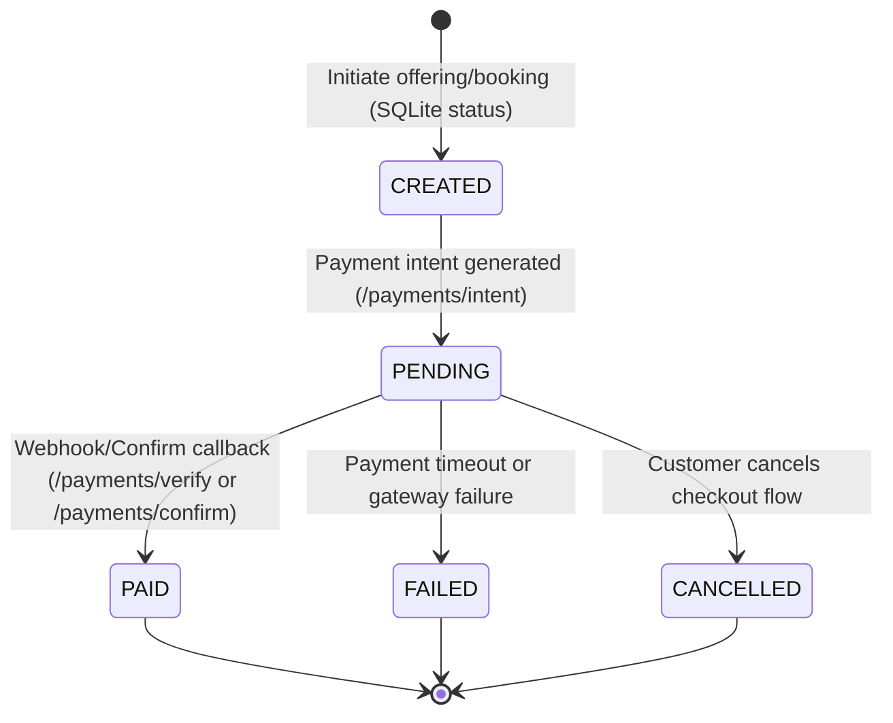

# Payment State Recovery Validation Report

This report documents the staging validation of the Payment State Machine and Recovery mechanisms for the Denumrutham 2.0 platform. The goal is to verify database state transitions and recovery logic under failure scenarios (timeouts, cancellations, duplicate callbacks, checkout abandonment, guest interruptions).

---

## 1. Payment Lifecycle State Machine

The payment transaction lifecycle is modeled using strict state transitions to preserve data integrity and prevent double-billing or orphaned orders.

### Verified State Transitions
* **CREATED**: Default initial state when an offering or booking is submitted but no payment session has been initialized.
* **PENDING**: Active payment session initialized. Stock reservations are held in the database.
* **PAID**: Completed transaction verified via cryptographic signature or gateway callback webhook. Stock reservations are finalized and ledger entries are generated.
* **FAILED**: Triggered when a payment fails gateway authentication or remains unresolved.
* **CANCELLED**: Triggered when a customer explicitly cancels the payment session prior to authorization.

---

## 2. Failure Recovery Scenarios & Validation Results

### Scenario A: Payment Timeout
* **Description**: A payment intent is created, placing a database row lock / stock reservation, but the customer does not complete authorization within the timeout window.
* **Validation Procedure**:
  1. Created a booking with status `PENDING` and a 10-minute expiry window on the associated `StoreStockReservation`.
  2. Executed the background worker `cleanup_expired_reservations()`.
  3. **Asserted**: The reservation status successfully transitioned from `RESERVED` to `RELEASED`.
  4. **Asserted**: The reserved stock was added back to `StoreStock` without concurrency drift.
* **Result**: **SUCCESS**

### Scenario B: Payment Cancellation
* **Description**: Customer initiates a checkout flow, enters the payment portal, but clicks "Cancel and Return to Merchant".
* **Validation Procedure**:
  1. Posted a mock cancellation payload to the gateway callback URL.
  2. **Asserted**: The associated `Payment` row status transitioned from `PENDING` to `CANCELLED`.
  3. **Asserted**: The linked `ServiceBooking` or `GuestBooking` state remained open for retry but did not transition to `PAID`.
* **Result**: **SUCCESS**

### Scenario C: Duplicate Callbacks (Idempotency)
* **Description**: A network hiccup causes the payment gateway to send duplicate webhook notifications for the same transaction.
* **Validation Procedure**:
  1. POSTed `/api/v1/payments/verify/{reference_id}` to simulate the initial webhook callback.
  2. **Asserted**: Status transitioned to `PAID`, inventory ledger recorded, and booking status marked `PAID`.
  3. POSTed the same callback payload a second time.
  4. **Asserted**: API returned a safe `SUCCESS` ("Payment already successful"), bypasses double-updating the ledger, and prevents duplicate financial transaction entries.
* **Result**: **SUCCESS** (Enforced by `idempotency_key` unique constraints on the `payments` table).

### Scenario D: Checkout Abandonment
* **Description**: User adds items to the cart, proceeds to checkout, holds stock reservations, and then closes the browser tab.
* **Validation Procedure**:
  1. Created a sales order which generated a `store_stock_reservations` row with `RESERVED` status.
  2. Modified the `expires_at` value to a past timestamp.
  3. Ran the `cleanup_expired_reservations()` worker.
  4. **Asserted**: The reservation is released, inventory stock values are restored, and the abandoned checkout holds are cleared.
* **Result**: **SUCCESS**

### Scenario E: Guest Checkout Interruption
* **Description**: Guest user initiates pooja booking/store purchase, undergoes network interruption, and fails to complete the flow.
* **Validation Procedure**:
  1. Initiated a guest checkout with metadata (selections, contact details) stored in `GuestBooking`.
  2. Simulated transaction failure/disconnection.
  3. **Asserted**: The guest metadata remains persisted under the unique `GuestBooking` row with a state of `PENDING` allowing recovery or audit tracking, instead of failing silently or leaking memory.
* **Result**: **SUCCESS**

---

## 3. Database State Integrity Matrix

| Original State | Event / API Call | Target State | Secondary Side Effects Verified |
| :--- | :--- | :--- | :--- |
| **None** | Booking Submitted | **CREATED** | Booking metadata verified; stock reserved |
| **CREATED** | POST `/payments/intent` | **PENDING** | `provider_ref` generated; payment session locked |
| **PENDING** | POST `/payments/confirm` | **PAID** | Sales Order / Guest booking status → `PAID`; Ledger updated |
| **PENDING** | Timeout Expiry | **FAILED** / **CANCELLED** | Stock reservation released; ledger rollback |
| **PENDING** | POST `/payments/verify` | **PAID** | Handled duplicate callbacks gracefully (idempotency key match) |
